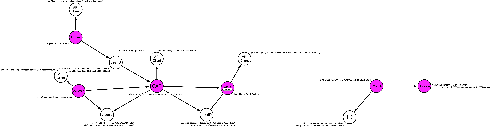

# MAP-CAP
## Run-Collection.ps1
### Description
This script will collect JSON data from Azure REST endpoints and consolidate them into a local neo4j instance to generate graph queries.
Additionally, this script will generate the relationships programatically via the local neo4j API endpoint.

## Query-Graph.ps1
### Description
This script will query query a local neo4j instance and enumerate relationships. 

---
# Setup
## Initiate default neo4j database
This POC assumes that the Neo4j version is 5.6. Setup 

## Get Graph API AccessToken

Run the following in a PS terminal:

```
# 1. Save the following variables:

$body = @{
    "client_id" = "1950a258-227b-4e31-a9cf-717495945fc2"
    "resource" = "https://graph.microsoft.com"
    }
$UserAgent = "Mozilla/5.0 (Macintosh; Intel Mac OS X 10_15_7) AppleWebKit/537.36 (KHTML, like Gecko) Chrome/103.0.0.0 Safari/537.36"
$Headers = @{}
$Headers["User-Agent"] = $UserAgent
```
```
# 2. Run the following Invoke-RestMethod 

$authResponse = Invoke-RestMethod `
    -UseBasicParsing `
    -Method Post `
    -Uri "https://login.microsoftonline.com/common/oauth2/devicecode?api-version=1.0" `
    -Headers $Headers `
    -Body $body
```
```
# 3. View the $authResponse.message variable to see the following prompt

PS > $authResponse.message
To sign in, use a web browser to open the page <https://microsoft.com/devicelogin> and enter the code RGC26UREK to authenticate.

# 4. Broswe to the link referenced above and input the code. 
Once the code is input, sign into the Tenant
```

```
# 5. Get the $accessToken by running the following lines:

$body = @{
    "client_id" = "1950a258-227b-4e31-a9cf-717495945fc2"
    "grant_type" = "urn:ietf:params:oauth:grant-type:device_code"
    "code" = $authResponse.device_code
    }

$Tokens = Invoke-RestMethod `
    -UseBasicParsing `
    -Method Post `
    -Uri "https://login.microsoftonline.com/Common/oauth2/token?api-version=1.0" `
    -Headers $Headers `
    -Body $body
```
```
# 6. Save the $Tokens.access_token variable as $accessToken

$accessToken = $Tokens.access_token
```
