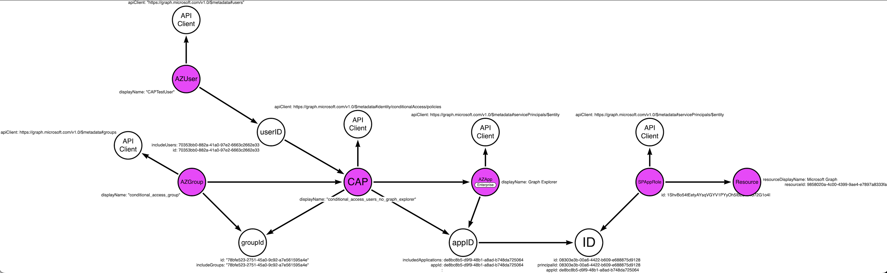
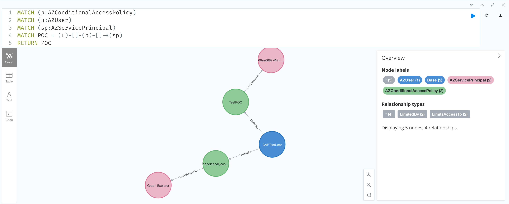

# MAP-CAP
## Run-Collection.ps1
### Description
The Run-Collection script allows users to gather JSON data about the Conditional Access Policies of an Azure Tenant. 
In many Azure environments, users are not granted access to view Conditional Access Policies. 
However, with that same level of permission, users can query the API endpoints of Conditional Access Policies, applications, users, and groups.
This enables assessors to determine the limiting relationship a Conditional Access Policy has against their profile.

### Relationship Mapping:
The mapping isn't too complex:
Conditional Access Policies contain fields:
    - includeApp = the applications listed as being limited by this CAP
        - Note: This field is listing the "appID" NOT the object ID of the Application!
    - includeUser = the users listed as being limited by this CAP to access the above mentioned application
    - includeGroup = the group listed as being limited by this CAP to access the above mentioned application

Applications contain the field:
    - appId = the application ID globally unique for all tenants
        - Note: This script will only pull applications contained within the Azure tenant that the accessToken belongs to
Users/Groups contain the field:
    - id = these are the user and group object ids of the user or group specified

The below image is how the relationship mapping works. There isn't currently a relationship between ServicePrincipals that is collected by the script as that is a future state effort.



### Goal
Ingest Conditional Access Policies and their related "include"(apps\users\groups) to determine possible attack paths that evade policies limiting access to applications within an Azure tenant. 
Ideally, assessors can ask Neo4j "Are there any CAPs between UserA and AppB...?"

Future state we can ask things like: "For any CAPs between UserA and AppB, what are the precise conditions that must be satisfied to grant the user access?"


### Example
```
# 1. Import the script as a module
impo Run-Collection.ps1
```
```
# 2. Run the script
Run-Collection -accessToken $accessToken
```
```
# 2.a. Other Examples of execution

.EXAMPLE 
ipmo ./Run-Collection.ps1
Run-Collection -accessToken $accessToken

.EXAMPLE 
ipmo ./Run-Collection.ps1
Run-Collection -beta -accessToken $accessToken

.EXAMPLE
ipmo ./Run-Collection.ps1
Run-Collection -beta -neo4JPassword "PASSWORD" -neo4JUserName "Username" -accessToken $accessToken
```
```
# 3. Expected Output
JSON returns can be saved in: /Users/jprager/Library/Application Support/Neo4j Desktop/Application/relate-data/dbmss/dbms-f3893e65-a2ef-4e32-8680-f74415c6dd25/import
Make sure to set unique constraints for future ingestion
Example: Run in Neo4j Desktop: CREATE CONSTRAINT BaseObjectID FOR (b:Base) REQUIRE b.objectid IS UNIQUE
Conditional Access Policies retrieved successfully.
Applications retrieved successfully.
Users retrieved successfully.
Groups retrieved successfully.
```
```
# 4. Navigate to Neo4j and type in the following command:
MATCH p = (n)-[]->(m) RETURN p
```
This command should render the graph view of the relationships between (users AND groups): Limited by Conditional Access Policies: To Applications contained in your Azure Tenant.


### Parameters
.PARAMETER accessToken
This is the bearer access token granted by your Azure tenant upon successful authentication. 
View the README.md and follow the steps listed to save your access token as a variable $accessToken

.PARAMETER beta
This is a context switch that will make the scrip utilize the /beta API endpoint instead of v1.0.

.PARAMETER neo4JURL
This parameter specifies the neo4j instance to target and ingest the JSON fields. Default is "http://localhost:7474"

.PARAMETER neo4JUserName
This parameter specifies the neo4j username used for authentication. Default is "neo4j"

.PARAMETER neo4JPassword
This parameter specifies the neo4j password used for authentication. Default is "neo4j"

---
# Setup
## Initiate default neo4j database
This POC assumes that the Neo4j version is 5.6. Setup
Make sure to set `apoc.import.file.enabled=true` in your `apoc.conf` if you'd like to ingest the JSON from the import directory

## Get Graph API AccessToken

Run the following in a PS terminal:

```
# 1. Save the following variables:

$body = @{
    "client_id" = "1950a258-227b-4e31-a9cf-717495945fc2"
    "resource" = "https://graph.microsoft.com"
    }
$UserAgent = "Mozilla/5.0 (Macintosh; Intel Mac OS X 10_15_7) AppleWebKit/537.36 (KHTML, like Gecko) Chrome/103.0.0.0 Safari/537.36"
$Headers = @{}
$Headers["User-Agent"] = $UserAgent
```
```
# 2. Run the following Invoke-RestMethod 

$authResponse = Invoke-RestMethod `
    -UseBasicParsing `
    -Method Post `
    -Uri "https://login.microsoftonline.com/common/oauth2/devicecode?api-version=1.0" `
    -Headers $Headers `
    -Body $body
```
```
# 3. View the $authResponse.message variable to see the following prompt

PS > $authResponse.message
To sign in, use a web browser to open the page <https://microsoft.com/devicelogin> and enter the code RGC26UREK to authenticate.

# 4. Broswe to the link referenced above and input the code. 
Once the code is input, sign into the Tenant
```

```
# 5. Get the $accessToken by running the following lines:

$body = @{
    "client_id" = "1950a258-227b-4e31-a9cf-717495945fc2"
    "grant_type" = "urn:ietf:params:oauth:grant-type:device_code"
    "code" = $authResponse.device_code
    }

$Tokens = Invoke-RestMethod `
    -UseBasicParsing `
    -Method Post `
    -Uri "https://login.microsoftonline.com/Common/oauth2/token?api-version=1.0" `
    -Headers $Headers `
    -Body $body
```
```
# 6. Save the $Tokens.access_token variable as $accessToken

$accessToken = $Tokens.access_token
```
Future state:
- Considerations surrounding Conditional Access Policy "all" statements
- Differentiate between applications listed under the user's tenant and service principals